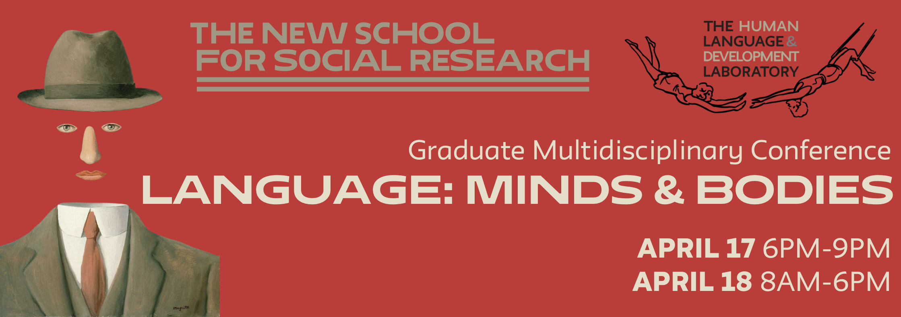

  <table cellpadding="0" cellspacing="0" border="0" style="border-collapse:collapse;">
    <tr>
      <td bgcolor="#CC0000" style="padding: 18px 44px; border: 4px solid #990000;">
        <a href="https://docs.google.com/forms/d/e/1FAIpQLSec4KSsoAYuMqxS0G9lUg2cqTuxwS121g_d2PvUNc1ZazurfQ/viewform?pli=1"
           target="_blank" rel="noopener"
           style="text-decoration:none;">
          

  <a href="https://docs.google.com/forms/d/e/1FAIpQLSec4KSsoAYuMqxS0G9lUg2cqTuxwS121g_d2PvUNc1ZazurfQ/viewform?pli=1"
     target="_blank" rel="noopener"
     style="
        display:inline-block;
        padding:18px 42px;
        background:#CC0000;
        color:white;
        font-size:28px;
        font-weight:800;
        text-decoration:none;
        border-radius:8px;
        border:4px solid #990000;
        letter-spacing:1px;
        box-shadow:0 4px 10px rgba(0,0,0,0.22);
     ">

  <a class="button" href="https://docs.google.com/forms/d/e/1FAIpQLSec4KSsoAYuMqxS0G9lUg2cqTuxwS121g_d2PvUNc1ZazurfQ/viewform?pli=1" target="_blank">
    SUBMIT HERE!
  </a>

  </a>

---
April 17, 6PM-9PM (moderated keynote discussion panel, welcome reception)

Wolff Conference Room, The New School
6 East 16th Street, New York, NY, 10011

April 18, 9AM-6PM (panel talks, poster session, lunch and closing reception)

Starr Foundation Hall
University Center, UL102
63 Fifth Avenue, New York, NY, 10011

---

The Human Language and Development Lab is hosting its third annual interdisciplinary graduate-student conference. This year, the conference is titled: **Language: Minds and Bodies**. We invite work that examines how minds and bodies co-inform language – how they may constitute distinct yet complementary modes of expression, how embodied experience shapes meaning, and how mental and physical processes collaborate in the production, comprehension, and development of language.

Historically, mind/body dualism has pervaded the social sciences and humanities – but to what extent are such distinctions useful? The study of language reveals, at minimum, that both minds and bodies are involved in language production and comprehension. On the one hand, linguistics and cognitive science typically approach human language in terms of higher-order structures (e.g., syntax) that organize and express thoughts. On the other hand, linguistic communication draws heavily on the body (e.g., gestures, lip reading, vocal cords, the brain) and, in turn, influences bodily states (e.g., emotionally-laden words may increase heart rate in conversation). Moreover, the term ‘body’ is not limited to the physical existence of an individual but also includes political, social, and cultural bodies. How do social practices, discourses, and institutions also shape our linguistic practices? Human language bridges the mind and body, the physical and immaterial, as well as the individual and social, making investigations into the nature of language ideally situated to overcome these long-lasting dualisms.

This interdisciplinary conference welcomes submissions from graduate students in the humanities, social sciences, natural sciences, fine and performing arts, and anyone else who is eager to share their innovative work on language. This conference is inspired by the twin observations that opportunities designed specifically to initiate cross-disciplinary collaborations are rare, and that graduate students are ideally poised to take advantage of such opportunities to generate influential new insights and frameworks.

This two-day conference will feature a keynote roundtable on Friday evening and graduate student presentations throughout the morning and early afternoon on Saturday. The conference will close with a seminar and evening reception for participants to discuss their newfound reflections on language and interdisciplinary research.

**Questions or concerns:**  
languageconference@newschool.edu

---

## Themes & Guiding Questions

### Language and Embodiment
- How does language operate differently in different "bodies" (individuals, groups, institutions), and how does this affect communication and meaning-making?
- What role do the embodied dimensions of language (e.g., signing, vocal cords, etc.) play in communication?
- How do embodied expressions of emotion shape non-verbal communication?
- How much of communication is linguistic? Conversely, what dimensions of language are non-communicative?
- Under what conditions can the mind extend beyond the body?
- What does it mean to speak to that which has no body? What role does the experience of the human body play in the type of communication we engage in? Is it different from communication with the non-human?
- What do practices like meditation reveal about the relationship between the mind and body?

### Language and Mind
- How do people use language to express "hidden thoughts”?
- “How can I know what I think until I see what I say?” What does this reveal about the relationship between articulation and self-discovery?
- Where in the body does language live? Where does it live in the world?
- What does it mean that “the unconscious is structured like a language”?
- How does language connect mind(s) and bodies?

### Language: Politics, Culture, & Society
- How can we understand organizations and political bodies as “speaking bodies” that both regulate and are regulated by language?
- How do societal norms and the body politic influence language use or shape our understanding of the world?
- Does linguistics miss key elements of language use by focusing on higher-order linguistic structures?
- How do linguistic practices sustain, contest, or transform the structures of communities/political bodies?
- How do different cultures communicate through body language?

### Language, Technology, & the Future
- What happens to language when the body is altered, limited, or technologically extended? (VR environments, disability, plastic surgery?)
- What can AI tell us about human-to-human interaction? What is the role of the human mind and body in discovering AI?
- How does internet culture influence our vocabularies? How has mass digitalization shaped our understanding of language and meaning?
- How do memes influence our shared vocabularies and vice versa?
- How do we speak to technology?
